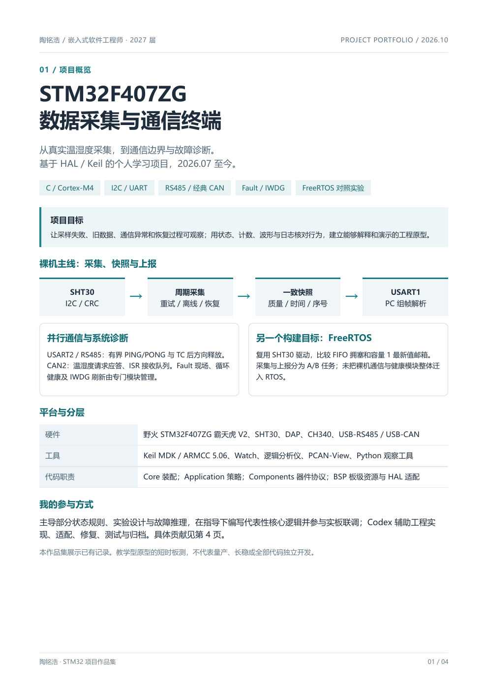

# STM32F407ZG 数据采集与通信终端

陶铭浩 · 2027 届 · 嵌入式软件 / MCU 固件方向

基于野火 STM32F407ZG 霸天虎 V2、HAL 和 Keil 的个人学习项目。从 SHT30 采集、数据快照与 PC 上报，扩展到有界通信、故障现场与健康门控；另建 FreeRTOS 采集 / 最新值邮箱对照实验。

本仓库是 **2026-10-05 当前工作区的展示快照**，未携带原仓库历史。历史实验属于不同版本，本次整理没有重跑固件或板测；不是统一版本的全功能验收。

## 作品集

[查看 / 下载 4 页 PDF 作品集](portfolio/project-portfolio.pdf) · [代表性故障诊断](docs/CASE_RS485.md) · [个人贡献](docs/CONTRIBUTIONS.md)



## 数据流与构建目标

```text
裸机主项目
SHT30 -> I2C/CRC -> 周期采集 -> 质量/时间/序号快照 -> USART1 -> PC
PC PING -> USART2/RS485 -> 有界 CRLF 状态机 -> TC 后释放方向 -> PONG
CAN2 RX IRQ -> 环形队列 -> 主循环校验 -> 温湿度请求应答
Fault/复位现场 -> 循环健康评估 -> IWDG 刷新门控

独立 FreeRTOS 实验
任务 A: 命令 -> RTOS 等待转换 -> 读取/CRC -> 成功覆盖最新值邮箱
任务 B: 接收副本 -> 诊断快照 -> 串口报告 -> 延时
```

裸机和 RTOS 是两个 Keil 目标。RTOS 复用驱动，没有把 CAN、RS485、Fault 和 IWDG 整体迁入。

## 建议先看

| 内容 | 入口 |
| --- | --- |
| 真实故障：收到完整 PING 却无回复 | [RS485 时间下溢案例](docs/CASE_RS485.md) |
| 历史波形、CAN 88 次应答、RTOS 地址恢复 | [证据与版本边界](docs/EVIDENCE.md) |
| 为什么选择最新值邮箱 | [FreeRTOS 对照实验](docs/RTOS.md) |
| 我做了什么、哪些由 Codex 辅助 | [贡献说明](docs/CONTRIBUTIONS.md) |
| Keil 构建、接线、PC 观察方法 | [运行说明](docs/BUILD.md) |

## 代表性代码

- [RS485 应用状态机与时间方向判断](Application/Src/app_rs485_service.c)
- [CAN 请求校验 / 5 字节大端响应编码](Application/Src/app_can_protocol.c)
- [CAN 环形队列入出队与短临界区](BSP/Src/bsp_can_rx_queue.c)
- [SHT30 器件驱动](Components/SHT30/Src/sht30.c)与[周期采集](Application/Src/app_sht30_collector.c)
- [健康条件门控](Application/Src/app_watchdog_gate.c)
- [FreeRTOS A/B 任务与诊断快照](Experiments/FreeRTOS_Queue/Application/Src/app_queue_experiment.c)

## 分层

| 目录 | 职责 |
| --- | --- |
| Core | 初始化、中断入口与模块装配 |
| Application | 采集、快照、上报、通信与健康策略 |
| Components | 器件协议与驱动 |
| BSP | 板级资源、HAL / 中断适配 |
| Drivers | ST HAL / CMSIS，保留上游版权与许可 |
| Middlewares | FreeRTOS V11.1.0 内核子集，仅独立实验使用 |
| Tests / Tools | 主机行为检查与 PC 串口工具 |

## 贡献与范围

本人主导部分策略、验收、实板联调和 RS485 时间下溢根因推导；在指导审查下编写 CAN 校验 / 编码及队列逻辑练习、RTOS 测量与失败记录。Codex 辅助完整工程实现、适配、集成、修复、测试及归档，RTOS 构建下载与本阶段板测取证由 Codex 完成。**不宣称全部代码独立手写。**

已有短时证据：RS485 历史 100/100，CAN 1 Hz 窗口 88/88；RTOS v4 正常窗口约 40 秒 14 条报告、地址 NACK 恢复。数字限定在各自版本与条件下，不合并成系统压力或长稳结论。

未完成 / 未验证：Modbus RTU、CANopen/J1939/UDS、bus-off、多节点与极限负载、整项目 RTOS 迁移、独立内核移植、DMA、Linux 驱动、Bootloader/OTA、量产与长期稳定性。当前 HSE 版 UART/RS485 专项回归待补。

## 许可与来源

第三方代码见 [THIRD_PARTY.md](THIRD_PARTY.md)。自编部分尚未另行授予通用开源许可证；此包用于求职展示与审阅，第三方许可保持原范围。项目于 2026-10-06 公开发布；源码快照与历史证据的适用日期分别说明。
