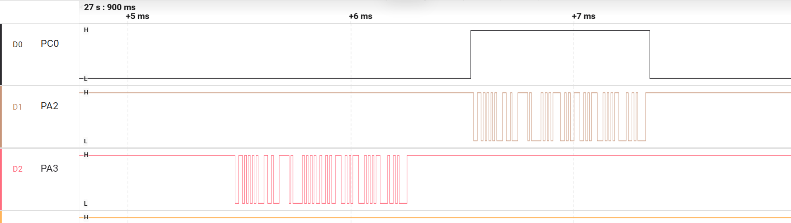

# RS485：完整 PING 没有响应的时间下溢诊断

来源：2026-09-04 模块记录；自定义 32 字节有界 CRLF PING/PONG、115200 8N1、100 ms 字节间超时。根因推理由陶铭浩在未预先获知根因时完成，源码修复和自动化集成由 Codex 完成，本人参与实板回归。

## 观察与区分

PC 发 PING 却超时。PA3 逻辑波形完整，PC0 保持低、PA2 不输出；Watch RX9、完整帧1、字节间超时1、语义无效1、有效 PING0、UART 错误0。

完整接收波形不支持本次线路未收到请求；方向未切换且无 TX，问题在生成回复前。超时和语义无效同时出现，需要解释为什么完整帧仍不匹配。

## 时间交错与根因

Core 先保存旧 `now_ms=1000`，随后 ISR 收首字节并记录时间 1001；消费时无符号 `1000-1001=4294967295`。旧逻辑把它当作超过 100 ms，清掉首字节 V；余下 `1|PING\r\n` 有 CRLF，结构完整但语义不合法，吻合计数。

当前 [源码](../Application/Src/app_rs485_service.c) 的静默检查只接受 `elapsed_ms < 0x80000000UL` 的正向模差，再检查 100 ms 阈值。它拒绝未来半区时间，并保留 Tick 回绕语义；不应把所有无符号减法改成忽略回绕的大小比较。

## 回归与方向

修正后单轮精确 PONG，错误计数为 0。正常响应的 [历史方向波形](../evidence/rs485_tc.png) 显示 PA3 请求、PC0 高、PA2 回复、最后停止位后 PC0 低。这不是原故障截图。

TC 表示数据寄存器与移位寄存器均空，最后停止位结束；TXE 只表示数据寄存器空。9 字节 / 115200 8N1 理论线时 0.78125 ms，截图中的方向高约 0.80 ms 为网格估算，不是精密最坏时序。

## 其他历史专项

- 100 轮停止等待：100 次 PONG、零超时，短时结果不代表长稳或最大吞吐。
- A-F 边界：精确 PING、语义无效 PANG、32 字节完整帧、超长后重同步、约 50 ms 分段、约 150 ms 半帧超时。
- CPU 暂停时接收导致硬件 ORE（0x08），同启动静默恢复后 PING 成功且保留错误历史。这不是实板软件队列溢出。
- A/B 对调故障与恢复只证明当时开发板 / UTS-T02 组合，不能推广所有厂商命名。
- [最终初始化修正版 Watch](../evidence/rs485_final_watch.png) 只证明新启动单轮干净冒烟。上述 A-F / 100 轮 / ORE 属此前版本，未全部重跑。

当前 HSE 版 UART / RS485 专项回归仍待补；该学习项目没有 Modbus、多节点冲突、高干扰、长距离或持续高负载完成证据。
